# Hi, I'm Carlos 👋

**Senior Software Engineer at Nubank · Backend & AI platform engineering · Based in Brazil**

I have 7+ years of experience building distributed systems for digital banking, e-commerce, and software consulting, with a focus on backend architecture, event-driven systems, and applied AI.

At Nubank, I'm part of the **Agentic Platform team**, building internal SDKs, LLM gateways, MCP servers, and reusable components and infrastructure for teams building AI agents across the company.

  
  
  
  
  

 Bachelor's in Software Engineering · PUCRS 
 [LinkedIn](https://www.linkedin.com/in/carlos-asrc) &nbsp;  [Email](mailto:carlos.asrc@gmail.com)

##  Experience timeline

<picture>
  <source media="(max-width: 600px) and (prefers-color-scheme: dark)" srcset="./assets/experience-dark-mobile.svg">
  <source media="(max-width: 600px)" srcset="./assets/experience-light-mobile.svg">
  <source media="(prefers-color-scheme: dark)" srcset="./assets/experience-dark.svg">
  
</picture>

[Nubank customer-support AI · Public case study](https://openai.com/index/nubank/)

Read the experience highlights

- **Nubank · Agentic Platform (current):** building and maintaining internal SDKs, LLM gateways, MCP servers, and reusable components and infrastructure for AI agent builders across the company. My work sits at the intersection of distributed systems, platform engineering, and AI.
- **Nubank · Customer-support AI (first year):** helped build and integrate GPT-4o into customer support as part of a cross-functional team working with OpenAI. I contributed to a real-time Call Center Copilot offering reply suggestions, chat summaries, and agent guidance, focusing on scalable backends and system integration. The [public case study](https://openai.com/index/nubank/) reports Copilot adoption by over 45% of agents, plus a 70% reduction in chat response times and 2.3x faster query resolution across the broader support solutions.
- **Mercado Livre:** built backend services for logistics and sales and operations planning, including asynchronous integration with data science workloads and improvements to memory-intensive spreadsheet processing.
- **ilegra / Agibank:** developed event-driven banking services with Spring Boot, Kafka, RabbitMQ, and Camunda, and supported an ecosystem of more than 40 microservice applications.

##  Learning & practice

| Track | Current focus |
| --- | --- |
|  **AI / LLM engineering** | Extending my applied AI experience: RAG, model selection, fine-tuning, agents, evaluation, observability, and reliable model workflows. |
|  **Cloud infrastructure** | Building on AWS, Docker, and Terraform experience through an AWS / Kubernetes / Terraform roadmap: networking, IAM, infrastructure as code, and deployment. |
|  **System design** | Sharpening tradeoffs around data modeling, caching, queues, consistency, retries, and scalability. |
|  **Algorithms & data structures** | Regular problem-solving practice, primarily in Python. |

##  Public projects

| Project | Technologies | What it explores |
| --- | --- | --- |
|  [URL Shortener](https://github.com/CarlosAsrc/url-shortener) | `Go` `AWS` `Terraform` | DynamoDB storage, ECS/EC2 infrastructure, and GitHub Actions for tests and container publishing to ECR. |
|  [NeetCode Submissions](https://github.com/CarlosAsrc/neetcode-submissions) | `Python` | Ongoing practice with trees, linked lists, binary search, backtracking, and dynamic programming. |
|  [Kafka → Elasticsearch](https://github.com/CarlosAsrc/sample-kafka-elasticsearch) | `Java` `Kafka` `Elasticsearch` | An earlier learning project exploring a producer–consumer data pipeline. |

##  Let's connect

I enjoy exchanging ideas about backend architecture, AI platforms, developer tooling, cloud infrastructure, and turning study into working software.

[Find me on LinkedIn](https://www.linkedin.com/in/carlos-asrc) or [send me an email](mailto:carlos.asrc@gmail.com).

🎓 Earlier academic work · Portuguese PDFs

- [Software Engineering Experimental Agency](https://github.com/CarlosAsrc/CarlosAsrc/files/8934020/Minha.Atuacao.na.Agencia.Experimental.de.Engenharia.de.Software.pdf)
- [Blockchain](https://github.com/CarlosAsrc/CarlosAsrc/files/8934021/Trabalho.Academico.-.Blockchain.pdf)
- [Bully algorithm](https://github.com/CarlosAsrc/CarlosAsrc/files/8934022/Trabalho.Academico.-.Bully.Algorithm.pdf)
- [Peer-to-peer systems](https://github.com/CarlosAsrc/CarlosAsrc/files/8934023/Trabalho.Academico.-.P2P.pdf)
- [Travelling salesman problem](https://github.com/CarlosAsrc/CarlosAsrc/files/8934024/Trabalho.Academico.-.Problema.do.caixeiro-viajante.Travelling.salesman.problem.pdf)
- [Parallel programming](https://github.com/CarlosAsrc/CarlosAsrc/files/8934025/Trabalho.Academico.-.Programacao.Paralela.pdf)
- [Systems security](https://github.com/CarlosAsrc/CarlosAsrc/files/8934026/Trabalho.Academico.-.Seguranca.de.Sistemas.pdf)

